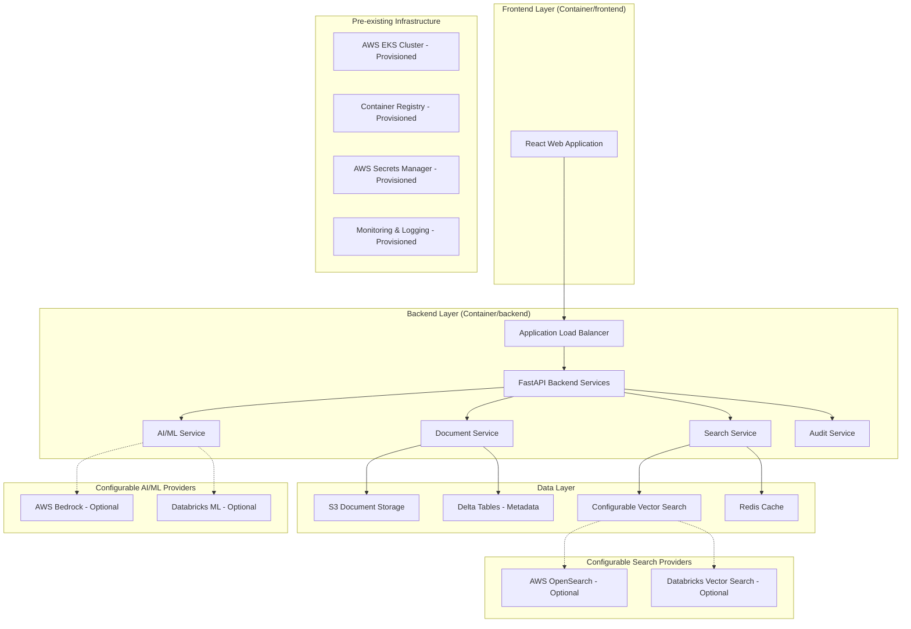

# Design Document: AI-Powered Clinical Documentation Portal

## Overview

The AI-Powered Clinical Documentation Portal is a comprehensive web application designed to provide intelligent access to Clinical Study Reports (CSR) and Trial Master File (TMF) documents. The system leverages modern cloud architecture, AI/ML capabilities, and regulatory compliance frameworks to deliver a secure, scalable, and auditable platform for clinical research professionals.

### Key Design Principles

- **Regulatory Compliance First**: All design decisions prioritize FDA, EMA, and ICH guidelines
- **Provenance and Auditability**: Every action and AI-generated content maintains full traceability
- **Scalable Cloud Architecture**: Built for enterprise-scale deployment on AWS
- **AI-Powered Intelligence**: Semantic search and summarization grounded in source documents
- **User-Centric Design**: Intuitive interface optimized for clinical research workflows

## Architecture

### High-Level System Architecture



**Architecture Notes:**
- Infrastructure (EKS, ECR, Secrets Manager) is pre-provisioned via separate infrastructure repository
- Frontend and Backend are containerized applications deployed to existing EKS cluster
- AI/ML providers (Bedrock vs Databricks) are configurable at runtime via admin settings
- Search providers (OpenSearch vs Databricks Vector Search) are configurable options
- All configuration managed through environment variables and admin interface

### Component Architecture

#### Frontend Architecture (React)

**Technology Stack:**
- React 18 with TypeScript
- Material-UI or Ant Design for clinical-grade UI components
- React Query for state management and caching
- React Router for navigation
- Axios for API communication

**Key Components:**
- Document Navigator (CSR/TMF toggle)
- Search Interface (keyword + semantic)
- Document Viewer with citation overlay
- AI Summary Panel
- Audit Trail Dashboard

#### Backend Architecture (FastAPI) - Container/backend

**Service-Oriented Architecture with Configurable Providers:**

1. **Document Service**
   - Document retrieval from S3
   - Metadata management with Delta tables
   - Version control and validation
   - Format validation for CSR/TMF compliance

2. **Search Service with Provider Abstraction**
   - Query processing and optimization
   - Configurable vector search backends:
     - AWS OpenSearch Service
     - Databricks Vector Search
   - Result ranking and aggregation
   - Search analytics and caching

3. **AI/ML Service with Provider Abstraction**
   - Configurable AI/ML providers:
     - AWS Bedrock (Claude, Titan models)
     - Databricks-hosted models (Llama, custom models)
   - Text summarization with provenance
   - Embedding generation
   - Model orchestration and fallback strategies
   - Provenance tracking for regulatory compliance

4. **Audit Service**
   - Comprehensive activity logging
   - Compliance reporting (21 CFR Part 11)
   - Role-based access control
   - Data lineage tracking

5. **Configuration Service**
   - Admin interface for provider selection
   - Runtime configuration management
   - Feature flag management
   - Environment-specific settings

### Data Architecture

#### Configurable Search and AI Provider Architecture

**Provider Abstraction Layer:**
```python
# Abstract base classes for pluggable providers
class SearchProvider(ABC):
    @abstractmethod
    async def search(self, query: str, filters: Dict) -> SearchResults
    
class AIProvider(ABC):
    @abstractmethod
    async def generate_summary(self, text: str, params: Dict) -> Summary
    
class VectorProvider(ABC):
    @abstractmethod
    async def similarity_search(self, embedding: List[float]) -> List[Match]
```

**Configuration Schema:**
```python
class SystemConfig(BaseModel):
    ai_provider: Literal["bedrock", "databricks"] = "bedrock"
    search_provider: Literal["opensearch", "databricks_vector"] = "opensearch"
    vector_provider: Literal["opensearch", "databricks_vector"] = "opensearch"
    
    # Provider-specific configurations
    bedrock_config: Optional[BedrockConfig] = None
    databricks_config: Optional[DatabricksConfig] = None
    opensearch_config: Optional[OpenSearchConfig] = None
```

#### Document Storage Schema (S3)

```
s3://clinical-docs-bucket/
├── csr/
│   ├── study-{id}/
│   │   ├── sections/
│   │   │   ├── 01-synopsis.pdf
│   │   │   ├── 02-introduction.pdf
│   │   │   ├── 03-objectives.pdf
│   │   │   └── ...
│   │   └── metadata/
│   │       └── study-metadata.json
├── tmf/
│   ├── study-{id}/
│   │   ├── zone-01/
│   │   ├── zone-02/
│   │   └── ...
└── processed/
    ├── embeddings/
    ├── chunks/
    └── summaries/
```

#### Metadata Schema (Delta Tables)

**Documents Table:**
```sql
CREATE TABLE documents (
    document_id STRING,
    study_id STRING,
    document_type STRING, -- 'CSR' or 'TMF'
    section_code STRING, -- ICH E3 section or TMF code
    title STRING,
    version STRING,
    created_date TIMESTAMP,
    modified_date TIMESTAMP,
    file_path STRING,
    file_size BIGINT,
    checksum STRING,
    status STRING, -- 'active', 'archived', 'draft'
    regulatory_classification STRING,
    access_level STRING
) USING DELTA
```

**Document Chunks Table:**
```sql
CREATE TABLE document_chunks (
    chunk_id STRING,
    document_id STRING,
    chunk_index INT,
    content TEXT,
    page_number INT,
    section_reference STRING,
    embedding ARRAY<FLOAT>,
    created_timestamp TIMESTAMP
) USING DELTA
```

**Audit Log Table:**
```sql
CREATE TABLE audit_log (
    log_id STRING,
    user_id STRING,
    action_type STRING,
    resource_type STRING,
    resource_id STRING,
    timestamp TIMESTAMP,
    ip_address STRING,
    user_agent STRING,
    details MAP<STRING, STRING>
) USING DELTA
```

## Components and Interfaces

### Frontend Components

#### 1. Document Navigator Component
```typescript
interface DocumentNavigatorProps {
  documentType: 'CSR' | 'TMF';
  onTypeChange: (type: 'CSR' | 'TMF') => void;
  studyId?: string;
}

interface DocumentNode {
  id: string;
  title: string;
  type: 'section' | 'document';
  children?: DocumentNode[];
  metadata: DocumentMetadata;
}
```

#### 2. Search Interface Component
```typescript
interface SearchProps {
  onSearch: (query: SearchQuery) => void;
  searchType: 'keyword' | 'semantic' | 'hybrid';
  filters: SearchFilters;
}

interface SearchQuery {
  text: string;
  type: 'keyword' | 'semantic' | 'hybrid';
  filters: {
    documentType?: 'CSR' | 'TMF';
    studyId?: string;
    sectionCodes?: string[];
    dateRange?: DateRange;
  };
}
```

#### 3. Document Viewer Component
```typescript
interface DocumentViewerProps {
  documentId: string;
  highlightTerms?: string[];
  showCitations: boolean;
  onCitationClick: (citation: Citation) => void;
}

interface Citation {
  id: string;
  documentId: string;
  pageNumber: number;
  sectionReference: string;
  text: string;
  confidence: number;
}
```

### Backend API Interfaces

#### 1. Document API Endpoints

```python
# FastAPI endpoint definitions
@app.get("/api/v1/documents/{document_id}")
async def get_document(
    document_id: str,
    include_content: bool = True,
    user: User = Depends(get_current_user)
) -> DocumentResponse

@app.get("/api/v1/studies/{study_id}/documents")
async def list_study_documents(
    study_id: str,
    document_type: Optional[DocumentType] = None,
    user: User = Depends(get_current_user)
) -> List[DocumentSummary]
```

#### 2. Search API Endpoints

```python
@app.post("/api/v1/search")
async def search_documents(
    query: SearchRequest,
    user: User = Depends(get_current_user)
) -> SearchResponse

@app.get("/api/v1/search/suggestions")
async def get_search_suggestions(
    partial_query: str,
    document_type: Optional[DocumentType] = None
) -> List[SearchSuggestion]
```

#### 3. AI/ML API Endpoints

```python
@app.post("/api/v1/ai/summarize")
async def generate_summary(
    request: SummarizationRequest,
    user: User = Depends(get_current_user)
) -> SummaryResponse

@app.post("/api/v1/ai/embeddings")
async def generate_embeddings(
    text: str,
    model_type: EmbeddingModel = EmbeddingModel.DEFAULT
) -> EmbeddingResponse
```

## Data Models

### Core Domain Models

#### Document Model
```python
from pydantic import BaseModel
from typing import Optional, List, Dict
from datetime import datetime
from enum import Enum

class DocumentType(str, Enum):
    CSR = "CSR"
    TMF = "TMF"

class DocumentStatus(str, Enum):
    ACTIVE = "active"
    ARCHIVED = "archived"
    DRAFT = "draft"

class Document(BaseModel):
    document_id: str
    study_id: str
    document_type: DocumentType
    section_code: str
    title: str
    version: str
    created_date: datetime
    modified_date: datetime
    file_path: str
    file_size: int
    checksum: str
    status: DocumentStatus
    regulatory_classification: str
    access_level: str
    metadata: Dict[str, Any]
```

#### Search Models
```python
class SearchResult(BaseModel):
    document_id: str
    title: str
    snippet: str
    relevance_score: float
    citations: List[Citation]
    highlights: List[TextHighlight]

class Citation(BaseModel):
    citation_id: str
    document_id: str
    page_number: int
    section_reference: str
    text_excerpt: str
    confidence_score: float
    provenance_chain: List[str]
```

#### AI/ML Models
```python
class SummaryRequest(BaseModel):
    document_id: str
    section_ids: Optional[List[str]] = None
    max_length: int = 500
    include_citations: bool = True
    model_parameters: Dict[str, Any] = {}

class SummaryResponse(BaseModel):
    summary_id: str
    content: str
    citations: List[Citation]
    model_info: ModelProvenance
    generated_at: datetime
    confidence_metrics: Dict[str, float]
```

## Error Handling

### Error Classification and Response Strategy

#### 1. Client Errors (4xx)
- **400 Bad Request**: Invalid search queries, malformed requests
- **401 Unauthorized**: Authentication failures
- **403 Forbidden**: Insufficient permissions for document access
- **404 Not Found**: Document or resource not found
- **429 Too Many Requests**: Rate limiting exceeded

#### 2. Server Errors (5xx)
- **500 Internal Server Error**: Unexpected application errors
- **502 Bad Gateway**: Downstream service failures (S3, Databricks)
- **503 Service Unavailable**: System maintenance or overload
- **504 Gateway Timeout**: AI model or search service timeouts

#### 3. Error Response Format
```python
class ErrorResponse(BaseModel):
    error_code: str
    message: str
    details: Optional[Dict[str, Any]] = None
    timestamp: datetime
    request_id: str
    support_reference: Optional[str] = None
```

#### 4. Retry and Fallback Strategies
- **Search Service**: Fallback to keyword search if semantic search fails
- **AI Summarization**: Graceful degradation to extractive summaries
- **Document Retrieval**: Multi-region S3 access with automatic failover
- **Authentication**: Cached token validation with refresh mechanisms

## Testing Strategy

### 1. Unit Testing
- **Frontend**: Jest + React Testing Library for component testing
- **Backend**: pytest for service layer and API endpoint testing
- **Coverage Target**: 90% code coverage for critical paths

### 2. Integration Testing
- **API Integration**: Full request/response cycle testing
- **Database Integration**: Delta table operations and data consistency
- **Search Integration**: End-to-end search workflow validation
- **AI/ML Integration**: Model inference and response validation

### 3. End-to-End Testing
- **User Workflows**: Complete user journey testing with Playwright
- **Cross-Browser Testing**: Chrome, Firefox, Safari, Edge compatibility
- **Performance Testing**: Load testing with realistic clinical document sizes
- **Security Testing**: Penetration testing and vulnerability assessment

### 4. Regulatory Compliance Testing
- **Audit Trail Validation**: Comprehensive logging verification
- **Data Integrity Testing**: Document versioning and provenance validation
- **Access Control Testing**: Role-based permission enforcement
- **Compliance Reporting**: Automated compliance report generation and validation

### 5. AI/ML Model Testing
- **Model Performance**: Accuracy, precision, recall metrics for summarization
- **Bias Detection**: Clinical terminology and demographic bias assessment
- **Provenance Validation**: Citation accuracy and traceability verification
- **Hallucination Detection**: Automated detection of unsupported claims in summaries

## Security and Compliance Considerations

### 1. Data Protection and Privacy
- **Encryption**: AES-256 encryption for data at rest, TLS 1.3 for data in transit
- **Data Masking**: PII redaction in logs and non-production environments
- **Data Retention**: Automated lifecycle management with regulatory retention periods
- **Cross-Border Data**: Compliance with regional data sovereignty requirements

### 2. Access Control and Authentication
- **Multi-Factor Authentication**: Integration with enterprise identity providers
- **Role-Based Access Control**: Granular permissions based on job functions
- **Session Management**: Secure session handling with automatic timeout
- **API Security**: OAuth 2.0 + JWT tokens with scope-based authorization

### 3. Regulatory Compliance Framework
- **21 CFR Part 11**: Electronic records and signatures compliance
- **ICH E6 (GCP)**: Good Clinical Practice guidelines adherence
- **GDPR/CCPA**: Privacy regulation compliance for personal data
- **SOX Compliance**: Financial reporting controls for public companies

### 4. Audit and Monitoring
- **Comprehensive Logging**: All user actions, system events, and data access
- **Real-time Monitoring**: Security incident detection and alerting
- **Compliance Reporting**: Automated generation of regulatory audit reports
- **Data Lineage**: Complete traceability from source documents to AI outputs

### 5. Infrastructure Security
- **Network Security**: VPC isolation, security groups, and network ACLs
- **Container Security**: Image scanning, runtime protection, and vulnerability management
- **Secrets Management**: AWS Secrets Manager integration with rotation policies
- **Backup and Recovery**: Automated backups with point-in-time recovery capabilities